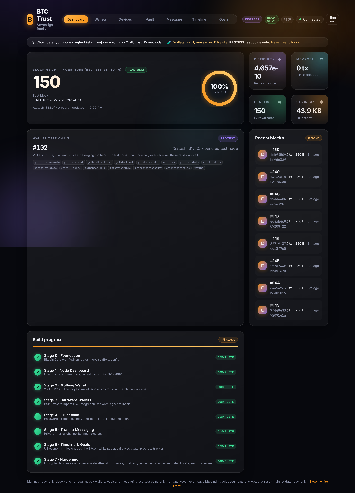
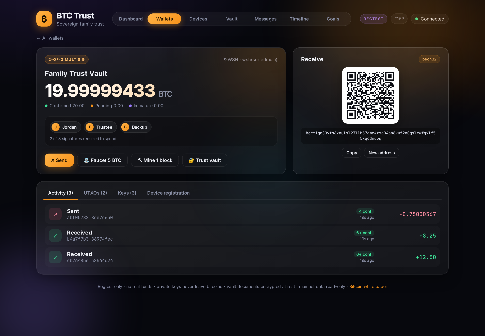
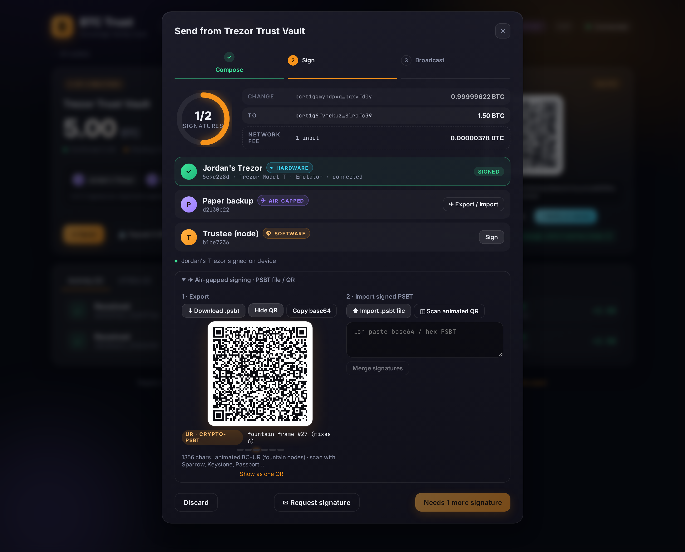
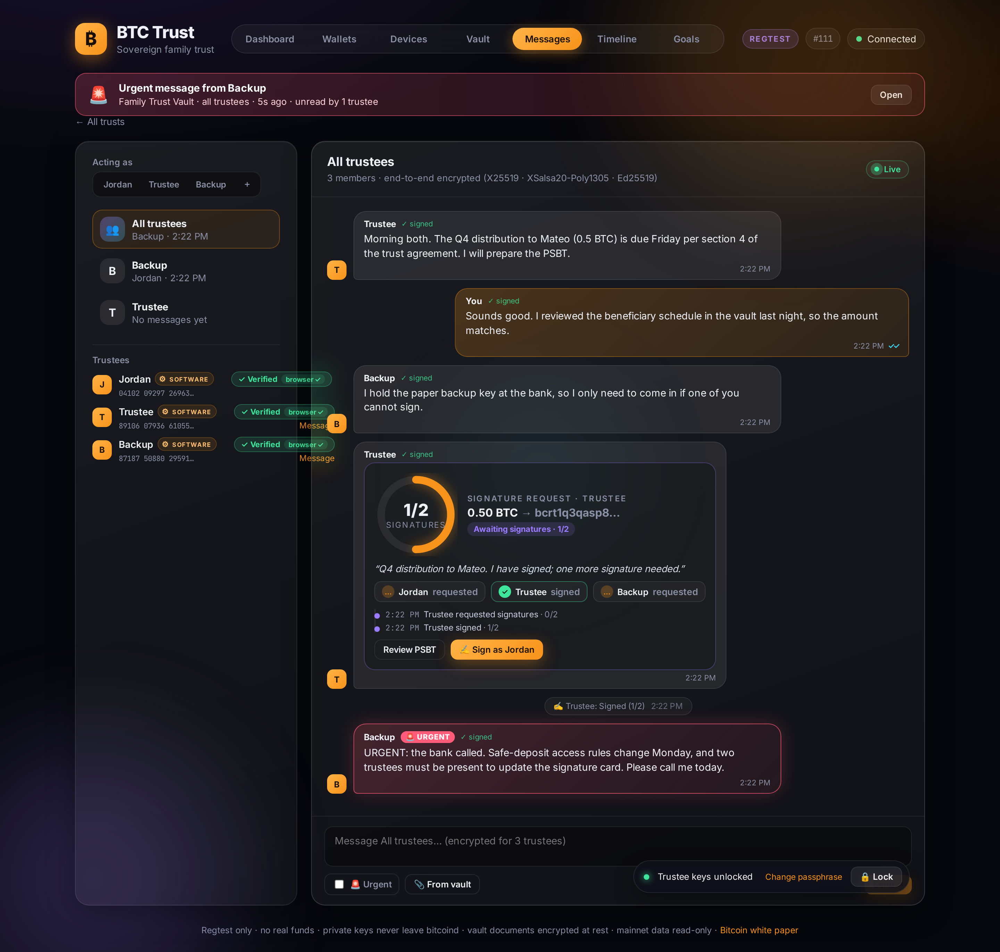

# BTC Trust

[](https://github.com/j03y0028/btc-trust/actions/workflows/ci.yml)
[](LICENSE)

A self-hosted Bitcoin **family trust** app for [myNode](https://mynodebtc.com) and other home nodes. It covers multisig custody,
hardware-wallet signing, an encrypted trust-document vault, private trustee messaging, and an economic timeline. It talks only to your own
Bitcoin Core over JSON-RPC.

> [!CAUTION]
> **Testing only: regtest/signet. Not audited. Not for real funds.**
> - Wallets, vaults, PSBT signing and messaging run on **regtest** (or signet) only. The backend refuses a mainnet wallet node.
> - On a myNode, mainnet is **read-only**. The app may call only 15 read-only RPC methods, enforced in code *and* by bitcoind `rpcwhitelist`.
> - **Never import real keys or send real bitcoin to any address this app shows.** See [SECURITY.md](SECURITY.md).

| Dashboard on myNode (split mode) | Multisig wallet | Encrypted trust vault |
|---|---|---|
|  |  |  |
| **Hardware-wallet signing** | **Trustee messaging** | **Timeline & goals** |
|  |  |  |

## Features by stage
| Stage | What it adds |
|---|---|
| 0 · Foundation | Verified Bitcoin Core 31.1 on regtest, repo scaffold, config with a mainnet guard |
| 1 · Node dashboard | Live chain stats, mempool, recent blocks |
| 2 · Multisig wallet | m-of-n P2WSH descriptor wallets (2-of-3 default), single-sig, watch-only, full PSBT lifecycle, regtest faucet |
| 3 · Hardware wallets | HWI integration (Trezor/Ledger/Coldcard…), PSBT export/import, on-device address verification, software-signer fallback |
| 4 · Trust vault | Passphrase-encrypted documents (scrypt + AES-256-GCM), templates (deed, beneficiaries, trustees…), attachments, an optional wallet-signature second factor, backups |
| 5 · Trustee messaging | End-to-end encrypted group and DM threads, keys bound to cosigners by signmessage attestations, signature requests linked to PSBTs |
| 6 · Timeline & goals | US economic milestones (FRED) vs. the Bitcoin white paper (SHA-256 checked), a daily mainnet block log, and a progress tracker |
| 7 · Hardening | Trustee keys encrypted in the browser, browser-side attestation checks, Coldcard/Ledger registration, animated BC-UR PSBT QR, security review |
| 8 · myNode packaging | Read-only mainnet split mode, test-only wallets on a bundled regtest node, app login, Docker image (amd64/arm64), myNode installer |

## Quick start (local regtest)
Requires Node 20+, plus a Bitcoin Core 31.x `bitcoind` (verify the download against the signed SHA256SUMS).
```bash
git clone https://github.com/j03y0028/btc-trust && cd btc-trust
cp .env.example .env          # set a regtest RPC password; it must match the node
npm run install:all
BITCOIN_BIN=/path/to/bitcoin/bin npm run node:start   # regtest bitcoind (or point .env at your own regtest node)
npm run dev                   # UI http://127.0.0.1:5173 · API http://127.0.0.1:4000
npm test                      # backend + frontend tests
```
Docker: `docker compose --env-file btctrust.env up -d` (see [docker-compose.yml](docker-compose.yml) and [btctrust.env.example](btctrust.env.example)).

## Install on myNode
Download the release package **on the myNode** and run the installer. The step-by-step guide is
**[docs/mynode-install.md](docs/mynode-install.md)**. Packages are on the [Releases](https://github.com/j03y0028/btc-trust/releases) page:
`…-x86_64.tar.gz` for x86 PCs (for example a Beelink mini PC), or the full package for a Raspberry Pi.

## Contributing, security, license
[CONTRIBUTING.md](CONTRIBUTING.md) · [SECURITY.md](SECURITY.md) · [docs/security-review.md](docs/security-review.md) · MIT, see [LICENSE](LICENSE).

---

# Developer reference

## Stack
- **backend/**: Node 20 + TypeScript, Express 5, minimal fetch-based Bitcoin Core RPC client, Vitest + Supertest
- **frontend/**: React 19 + Vite + TypeScript, hand-written dark glass UI (no UI framework), Vitest + Testing Library (happy-dom)
- **Bitcoin Core 31.1**: official binaries from bitcoincore.org, checked with SHA256SUMS and GPG (installed at `/workspace/bitcoin/bin`)

## Layout
```
backend/src/config.ts     env config (+ mainnet guard)
backend/src/rpc.ts        JSON-RPC client
backend/src/service.ts    chain summary + recent blocks
backend/src/stages.ts     roadmap / stage status
backend/src/app.ts        Express routes
backend/src/wallets.ts    wallet service (multisig / single-sig / watch-only, PSBT flow)
backend/src/store.ts      per-wallet config store
backend/src/faucet.ts     regtest faucet
backend/src/hwi.ts        HWI CLI adapter   · hwi-mock.ts  mock adapter
backend/src/devices.ts    device service (paths, xpub, sign, display)
backend/src/bech32.ts     segwit address decoder (device vs node address check)
backend/src/timeline/     FRED cache, events, chain parsing, mainnet snapshots, progress
backend/src/cli/          daily-snapshot.ts, fetch-whitepaper.ts
backend/test/             unit + regtest integration tests
frontend/src/App.tsx      dashboard
frontend/src/pages/       Dashboard, Wallets, WalletDetail, Devices, Vault, Messages, Timeline, Goals
frontend/src/components/  StatCard, SyncRing, RecentBlocks, StageTracker, CreateWalletWizard, SendFlow, SigRing, QrCode, Modal
scripts/                  regtest-node.sh, dev.sh, screenshot.mjs
screenshots/stage1.png
```

## API
| Endpoint | Description |
|---|---|
| `GET /api/healthz` | liveness probe for the Docker healthcheck (no login needed) |
| `GET /api/auth/status`, `POST /api/auth/{setup,login,logout,passphrase}` | app login: first-run setup with a one-time token, passphrase sign-in (session cookie), change passphrase (revokes all sessions) |
| `GET /api/mode` | `standalone` or `split`; mainnet allowlist (methods, refused count), wallet chain, whether login is required |
| `GET /api/health` | RPC connectivity (returns 503 when bitcoind is down) |
| `GET /api/blockchain` | network, height, headers, best hash, difficulty, sync %, IBD, size on disk, mempool, node version and peers |
| `GET /api/blocks?count=N` | the newest N blocks (up to 50), newest first. Add `?source=mainnet` here or on `/api/blockchain` to read your node through the read-only allowlist |
| `GET /api/stages` | roadmap stages and their status |
| `GET /api/wallets` | list wallets with their config and balance |
| `POST /api/wallets` | create a wallet: `{name, type: multisig\|singlesig\|watchonly, m?, n?, cosignerLabels?, externalKeys?, descriptor?, xpub?}` |
| `GET /api/wallets/:id` | details: balance, public descriptors, cosigners, addresses, UTXOs, history |
| `POST /api/wallets/:id/address` | new receive address |
| `POST /api/wallets/:id/psbt` | build a funded PSBT `{outputs:[{address, amount}], feeRate?}` |
| `POST /api/wallets/:id/psbt/{decode,sign,combine,finalize,broadcast}` | PSBT lifecycle (`sign` takes `{psbt, cosigner}`) |
| `POST /api/wallets/:id/psbt/export` | download the binary BIP-174 `.psbt` file (air-gapped) |
| `POST /api/wallets/:id/psbt/import[?base=]` | import a signed PSBT (binary file, base64/hex text, or JSON) and merge it into `base` |
| `POST /api/wallets/:id/verify-address` | show a receive address on a hardware cosigner and compare it with bitcoind |
| `GET /api/devices[?refresh=1]`, `GET /api/devices/status` | HWI enumeration and status |
| `POST /api/devices/:fingerprint/xpub` | `{purpose: multisig\|singlesig}` → `[fp/48h/1h/0h/2h]tpub…/0/*` (BIP48) or BIP84 |
| `GET /api/vaults/:walletId/status` | vault exists / unlocked, KDF + cipher, second-factor signer |
| `POST /api/vaults/:walletId` | create `{passphrase, secondFactor?: {cosigner, address?}}` → session |
| `POST /api/vaults/:walletId/unlock[/sign\|/verify]` | passphrase → session, or a signmessage challenge; `sign` asks the node/device, `verify` checks a pasted signature |
| `POST /api/vaults/:walletId/{lock,ping}` | end the session / keep it alive |
| `GET\|POST /api/vaults/:walletId/documents`, `GET\|PUT\|DELETE …/documents/:docId` | encrypted documents; `PUT` adds a SHA-256-hashed version when content changes |
| `GET /api/vaults/:walletId/templates/:type` | deed, beneficiaries, trustees, succession, descriptor-backup, note, filled from the wallet |
| `…/documents/:docId/versions/:v/verify`, `POST\|GET …/versions/:v/anchor` | re-hash a version; anchor it on regtest via OP_RETURN / verify it on chain |
| `POST\|GET …/documents/:docId/attachments[/:attId]` | encrypted PDF/PNG/JPEG/GIF/WebP files (raw body, `x-filename`), max 10 MB |
| `POST /api/vaults/:walletId/{passphrase,second-factor}` | re-encrypt with a new passphrase / set or clear the wallet-signature factor |
| `GET /api/vaults/:walletId/backup`, `POST …/restore` | export the encrypted backup (still ciphertext) / verify and restore it `{backup, passphrase, overwrite?}` |
| `GET /api/messaging/:walletId/directory` | trustees, attested identities (verified, safety number), previous keys |
| `POST /api/messaging/:walletId/identities[/prepare\|/sign]` | build, sign (node/device) and register a signmessage attestation binding Ed25519/X25519 keys to a cosigner |
| `GET /api/messaging/:walletId/threads`, `GET\|POST …/threads/:threadId/messages[?since=]`, `POST …/read` | encrypted envelopes (`group` or `dm:<fp>:<fp>`), signed read receipts. Requires `x-trustee-auth` |
| `GET\|POST /api/messaging/:walletId/sigrequests`, `POST …/sigrequests/:id/{sign,import,broadcast}` | signature requests linked to a PSBT, with live status |
| `GET /api/messaging/alerts` | unread urgent messages (metadata only) for the escalation banner |
| `WS /api/ws` | live delivery: `{"type":"hello","walletId","token"}`, then message, delivered, receipt, identity and sigrequest events |
| `GET /api/timeline[?since=YYYY-MM-DD]`, `POST /api/timeline/refresh` | FRED series (cached, with fetch date + source URL), cited events, verified genesis/halving data, white-paper hash check |
| `GET /api/mainnet/daily`, `POST /api/mainnet/snapshot` | read-only mainnet daily log, streak, blocks since genesis, next-halving estimate / take today's snapshot (idempotent) |
| `GET /api/progress` | stages with achievements, commit hashes and test counts from git, plus the backlog |
| `GET /api/wallets/:id/registration` | per-cosigner registration needs (Trezor: none), connected devices, recorded registrations |
| `GET /api/wallets/:id/registration/coldcard[.txt]`, `POST …/coldcard/confirm` | Coldcard multisig setup file (JSON preview or download) / record that it was imported |
| `POST /api/wallets/:id/registration/ledger`, `GET …/ledger/:cosigner/verify` | BIP-388 wallet policy registration (**mock Ledger**) → policy id + HMAC / re-check the stored HMAC |
| `POST /api/regtest/{mine,fund}` | **regtest only**: mine blocks, or send coins from the faucet wallet |

### Wallet model (Stage 2)
- **Multisig (default 2-of-3, or any m-of-n with 1 ≤ m ≤ n ≤ 15):** each cosigner key is generated in its own bitcoind descriptor wallet
  (`btctrust-<id>-keyN`). A watch-only wallet (`btctrust-<id>`) imports the `wsh(sortedmulti(m, …/0/*))` receive descriptor and the `/1/*` change descriptor.
  To spend: `walletcreatefundedpsbt` on the watch-only wallet, then `walletprocesspsbt` on each cosigner wallet, then combine, finalize and `sendrawtransaction`.
  `externalKeys` lets a hardware-wallet xpub act as one of the cosigners (Stage 3).
- **Single-sig:** one bitcoind wallet using wpkh, with the same PSBT flow at 1/1.
- **Watch-only:** imported from a descriptor (m-of-n is detected) or from an xpub (becomes wpkh). It can build PSBTs but has no local signer.
- Per-wallet config (public data only) is stored in `data/wallets.<network>.json`.
- **Key safety:** private keys never leave bitcoind. Incoming requests that contain `tprv`/`xprv`/WIF keys are rejected, and a response
  guard blocks any API reply that contains an extended private key.
### Hardware wallets (Stage 3)
- **HWI 3.2.0:** the official release binary in `/workspace/hwi/hwi`. Its SHA256 matched `SHA256SUMS.txt.asc`, and that file has a good GPG signature from Ava Chow's key `1528 1230 0785 C964 44D3 334D 1756 5732 E08E 5E41`.
  `src/hwi.ts` runs it as a subprocess, one call at a time, with a timeout: `enumerate`, `getxpub`, `displayaddress --desc`, `signtx`.
- **Emulator:** Trezor Model T core emulator v2.7.0 (`data.trezor.io`), running headless. Start it with `npm run emu:start`. It is loaded with the **public test mnemonic** `all all … all`, so never use it for real funds.
  HWI finds it with `--emulators` and auto-confirms prompts on the emulator. Real devices need you to confirm on the device screen.
- **Mock adapter** (`src/hwi-mock.ts`, `HWI_MODE=mock`): for CI and machines without an emulator. Its "device" keys are a bitcoind regtest wallet.
  It always uses the BIP84 path and reports it honestly. `test/devices.integration.test.ts` uses it; `test/hwi-emulator.integration.test.ts` uses the real HWI and emulator and is skipped when they are unavailable.
- **Signer kinds** (stored per cosigner): **Hardware** (HWI device, matched by master fingerprint), **Software** (bitcoind wallet on this node),
  **Air-gapped** (xpub only; export the PSBT as a `.psbt` file or a single-frame QR up to about 2.2k chars, then import the signed file or text).
- **Software fallback:** if a hardware cosigner isn't connected, signing it returns `409 DEVICE_NOT_CONNECTED`. Retrying with `fallback: true`
  (the UI's "Use software fallback" button), or calling sign without choosing a cosigner, has the next unsigned software cosigner sign instead. The response records `signer.fallback`.
  A hardware single-sig wallet has no fallback (`NO_FALLBACK`).
- **Addresses on the device:** Trezor shows regtest addresses with the `tb1` HRP. `verify-address` compares the witness programs.
- **Multisig registration:** not needed on Trezor. Ledger, Coldcard and BitBox02 need the multisig registered on the device first (planned).

- **Regtest faucet:** `btctrust-faucet` is funded by mining. Regtest halves the block reward every 150 blocks, so on a long chain run `npm run node:reset`.

### Trust vault (Stage 4)
Each wallet can have one encrypted vault of trust documentation: the deed, beneficiaries, trustees (roles mapped to cosigner fingerprints), succession/recovery instructions, a descriptor backup (public data only) and notes, plus encrypted PDF/image attachments. **The templates are not legal advice.**

- **Crypto (Node's built-in OpenSSL, no custom primitives):** scrypt (N=2^17, r=8, p=1, 16-byte salt) derives a key-encryption key from the passphrase (NFKC-normalized, at least 10 characters). That key wraps a random 256-bit data key with AES-256-GCM. The data key encrypts the document index and each attachment with AES-256-GCM (fresh 96-bit IV). AAD binds every ciphertext to its wallet, its role and, for the index, the second-factor setting, so swapping files, attachments or settings is detected (`422 TAMPERED`).
- **On disk:** `data/vaults/<walletId>.vault.json` (KDF params, wrapped key, encrypted index) and `data/vaults/<walletId>/<id>.bin` hold ciphertext only. Plaintext and keys stay in server memory for the session only and are zeroed on lock.
- **Unlock:** a wrong passphrase gives `401`. After 5 failures, unlocking backs off with `429`. Sessions auto-lock after `VAULT_IDLE_MS` of inactivity (default 5 min, with a countdown in the UI). Tokens live in browser memory only, so a reload locks the vault.
- **Wallet-signature second factor (optional):** after the passphrase, a one-time challenge (5-minute expiry, 3 attempts) must be signed with the chosen cosigner's identity key. That is P2PKH at `m/44h/1h/0h/0/0` of the same seed, verified by bitcoind `verifymessage`. Software cosigners sign with bitcoind `signmessage`, hardware cosigners with HWI `signmessage` (tested on the Trezor emulator), and air-gapped cosigners paste a signature for a P2PKH address they supply.
- **Integrity:** every version stores the SHA-256 of its content, re-checked on read. A version hash can be anchored on regtest (OP_RETURN `BTV1‖sha256`, funded by the faucet, then a block is mined). Verification shows block height, txid, block hash and confirmations.
- **Passphrase change:** fully re-encrypts with a new salt and a new data key, re-seals every attachment, and signs out other sessions. **Backup:** a single JSON file that is still ciphertext. Restore verifies the passphrase and every attachment tag before writing anything.

### Trustee messaging (Stage 5)
An end-to-end encrypted channel between a trust's key holders. Each wallet has an all-trustees thread and 1:1 threads.
Message types are text, a **signature request** linked to a PSBT, an urgent flag, and a reference to a Trust Vault attachment.
Messages carry delivery and read receipts, arrive live over WebSocket, and queue in an offline outbox when the node is unreachable.

- **Crypto (TweetNaCl, audited, the same code in browser and server: `shared/msgcrypto.ts`):** keys are generated in the browser and never sent.
  - Each message has a random key and is sealed with XSalsa20-Poly1305. That key is wrapped for every member (sender included) with X25519 `box`.
  - The whole envelope is Ed25519-signed, so tampering with ciphertext, recipients, urgent flag, thread or time is detected.
  - The server stores and relays ciphertext plus routing metadata only.
- **Identity binding:** the cosigner's Bitcoin key signs an attestation of the messaging keys with `signmessage`, the same identity key as the vault second factor. Node, HWI device or air-gapped paste can sign. The server verifies it with `verifymessage`. Badges show ✓ Verified and a safety number for out-of-band comparison.
- **Signature requests:** "Request signature" on the PSBT screen notifies trustees. Each signs with their own cosigner key from the chat card. Status (n/m, timeline, broadcast) updates live.
- **Urgent:** unread urgent messages raise an app-wide banner until every recipient has read them.

Design notes, metadata exposure, the Tor/myNode transport and dead-man/time-lock future work are in [docs/trustee-messaging.md](docs/trustee-messaging.md).

### Timeline & goals (Stage 6)
Only real, sourced data. Nothing is typed in by hand except the event list, and every event carries a primary-source citation.
- **U.S. macro (FRED, St. Louis Fed):** CPIAUCSL, M2SL, FEDFUNDS, GDP, UNRATE are downloaded from `https://fred.stlouisfed.org/graph/fredgraph.csv?id=…`.
  The raw CSVs are cached in `data/fred/`, with `meta.json` recording the fetch time and URL, and refreshed after 24 h (the stale cache is served on failure).
  The chart rebases levels to Oct 2008 = 100, the white-paper month, and plots rates in %. It has a brush zoom, range presets, and series and event overlay toggles.
- **Events** (`backend/src/timeline/events.ts`): Bear Stearns/PDCF, Lehman, TARP, QE1–3, ZIRP, ARRA, first hike, COVID cut, CARES, ARP, the 2022 hikes, BTFP and the 2024 cut.
  Each cites federalreserve.gov, federalreservehistory.org or congress.gov.
- **Bitcoin:** the white paper is bundled at `frontend/public/bitcoin.pdf` by `npm run whitepaper:bundle`, which refuses to write unless the SHA-256 is
  `b1674191…f553`, and it is re-hashed on every load.
  The genesis block's 80-byte header and coinbase transaction are fetched from mainnet and verified locally: double-SHA256 equals the genesis hash, PoW meets the target, and the merkle root equals the coinbase txid.
  The Times headline is decoded from the coinbase scriptSig.
  Halving blocks 210k/420k/630k/840k come from fetched headers whose hash and PoW are checked. Block 1,050,000 is estimated from the average interval since block 840,000.
- **Daily mainnet log** (`data/daily-blocks.json`, `npm run daily:snapshot`, plus an hourly backend job): one entry per local date (idempotent).
  - Each source's tip hash is checked against its own header (hash + PoW), and height comes from `/block/:hash/status`.
  - The sources are mempool.space and blockstream.info, cross-checked: `agree`, `disagree` (different hash at the same height, or a lagging tip not on the leader's chain), `single-source` or `unavailable`.
  - If a primary fails (e.g. HTTP 429), the independent mempool.emzy.de instance is queried so a cross-check is still possible.
  - With `MAINNET_RPC_HOST` set (myNode), the node's `getblockchaininfo` is primary and the public APIs become the check. Only read-only RPCs are used.
- **Goals page:** stage commits and test counts come from `git log` / `git grep` at each stage commit, alongside the backlog.

## Run
```bash
cp .env.example .env              # set RPC credentials (must match bitcoin.conf)
npm run install:all
npm run node:start                # regtest bitcoind (datadir /workspace/bitcoin/data)
npm test                          # backend typecheck + tests, frontend tests + build
npm run dev                       # API :4000, UI http://127.0.0.1:5173 (logs in .run/)
npm run screenshot                # writes screenshots/stage1.png (needs Playwright chromium)
npm run seed                      # demo regtest wallets (vault 2-of-3, spending, 3-of-5, auditor watch-only)
npm run screenshot:stage2         # stage2-wallets/-wizard/-wallet-detail/-send.png
npm run node:reset                # wipe the regtest chain + wallets
npm run emu:start                 # headless Trezor emulator + test seed (needs libsdl2-image)
npm run screenshot:stage3         # stage3-devices/-wizard/-wallet-detail/-sign.png
npm run screenshot:stage4         # seeds a demo vault (Trezor 2nd factor) → stage4-vault-locked.png, stage4-vault.png
npm run screenshot:stage5         # seeds demo trustees + encrypted thread → stage5-messages.png, stage5-sigrequest.png
npm run daily:snapshot            # append today's read-only mainnet tip snapshot to data/daily-blocks.json (idempotent per date)
npm run whitepaper:bundle         # re-download bitcoin.pdf, bundle only if the SHA-256 matches
npm run screenshot:stage6         # stage6-timeline.png, stage6-goals.png
bash scripts/regtest-node.sh cli -generate 1   # mine a block and watch the dashboard update
```

### Hardening (Stage 7)
- **Encrypted trustee keys (browser):** messaging secrets live in `localStorage` only as an scrypt (N=2^17, r=8, p=1) + AES-256-GCM
  keyring (`frontend/src/lib/keystore.ts`). Unlock with a passphrase (≥10 chars); it auto-locks after 5 min idle and the key is held in memory only.
  An old plaintext v1 keyring is encrypted, verified by decrypting it back, and only then deleted. The passphrase can be changed (new salt).
- **Client-side attestation check:** the browser recomputes each identity's attestation statement and verifies the BIP-137 signature against the
  cosigner address itself (noble secp256k1), so a server that swaps messaging keys is caught (`⚠ Browser check failed`, the identity is not used).
- **Device registration** (wallet → *Device registration*):
  - **Trezor:** no registration needed. Trezor validates multisig change from the PSBT's xpubs on every signing; verified on the Trezor emulator.
  - **Coldcard:** generates the multisig setup file (`Name`, `Policy`, `Format: P2WSH`, `Derivation`, `XFP: tpub`) as a download and a QR.
    A firmware-rule parser turns it back into a descriptor, and bitcoind confirms the checksum and the first address. Not run on a Coldcard simulator.
  - **Ledger:** builds the BIP-388 policy `wsh(sortedmulti(m,@0/**,…))` and its policy id, byte-identical to `ledger_bitcoin`'s test vectors.
    Registration runs against a **mock device** (HMAC-SHA256), because HWI 3.2.0 has no register command and Speculos isn't set up here.
- **Animated QR (BC-UR `crypto-psbt`):** PSBTs larger than 600 characters export as a fountain-coded multi-frame QR. Import works from the camera
  (jsQR) or by pasting parts, and tolerates dropped or out-of-order frames.
- **Security review:** Host allowlist (DNS rebinding), cross-site guard on unsafe methods (CSRF), WebSocket Origin check, rate limits, helmet
  headers, a production CSP, self-hosted fonts, owner-only data files and `.env`, and a clean `npm audit`. Details and remaining items are in
  [docs/security-review.md](docs/security-review.md).

### myNode packaging (Stage 8)
- **Split mode** (`APP_MODE=split`): the dashboard, daily snapshots and timeline read **mainnet** from your node through `ReadOnlyRpc`
  ([backend/src/readonly-rpc.ts](backend/src/readonly-rpc.ts)). It is a frozen allowlist of 15 read-only methods; anything else (wallet, send, sign,
  import, `stop`, any `/wallet/` path, case tricks) is refused with `-32604` **before** a request is sent. Wallets, vaults, messaging and PSBTs
  run on a **separate regtest/signet node** (`TestChainRpc` refuses to talk to a mainnet node), or are switched off (`WALLET_FEATURES=off`).
- **Defense in depth:** a dedicated `rpcauth` user plus bitcoind's own `rpcwhitelist` (and `rpcwhitelistdefault=0`). bitcoind returns 403 for
  everything else, even if the app were compromised. This is tested against a real bitcoind.
- **App login:** a passphrase set on first run with a one-time setup token, scrypt-hashed (`data/auth.json`), in an HttpOnly SameSite session cookie
  with lockout. It is required whenever the API binds beyond loopback (`AUTH_MODE=auto|on`).
- **Packaging:** a multi-stage [Dockerfile](Dockerfile) (one port, 9330, serving the built SPA plus the API; non-root; healthcheck; verified Bitcoin Core
  31.1 for the test node; amd64 + arm64 via buildx), [docker-compose.yml](docker-compose.yml), and the myNode app definition in [mynode/btctrust](mynode/btctrust)
  with [install-mynode.sh](mynode/install-mynode.sh) and [uninstall-mynode.sh](mynode/uninstall-mynode.sh). `scripts/package-mynode.sh` builds the tarball.
- **Install guide for Joey:** [docs/mynode-install.md](docs/mynode-install.md).
- **Simulated myNode:** `scripts/mynode-sim.sh up`, then `backend/node_modules/.bin/tsx scripts/verify-mynode-sim.mts` (50 end-to-end checks), then
  `scripts/mynode-sim.sh down`.

## Roadmap
0. Foundation ✅ · 1. Node dashboard ✅ · 2. Multisig wallet (2-of-3 P2WSH descriptors) ✅ · 3. Hardware wallets (PSBT/HWI) ✅ ·
4. Encrypted trust vault ✅ · 5. Trustee messaging ✅ · 6. Timeline (US economy milestones + [white paper](https://bitcoin.org/bitcoin.pdf)), daily mainnet log and goals tracker ✅ ·
7. Hardening (encrypted trustee keys, device registration, animated UR QR, security review) ✅ ·
8. myNode packaging (read-only mainnet, test-only wallets, app login, Docker) ✅

Next: Tor transport · independent security audit · real-device Ledger/Coldcard validation · install on a physical myNode · per-trustee accounts

## myNode deployment notes
See [docs/mynode-install.md](docs/mynode-install.md). In short: copy the package, run `sudo ./install-mynode.sh`, approve the bitcoind restart, then open
`http://mynode.local:9330` and enter the setup token. **Do not set `BITCOIN_NETWORK=main` on myNode.** Split mode is the supported setup, and it
refuses a mainnet wallet chain even with `ALLOW_MAINNET=true`.
